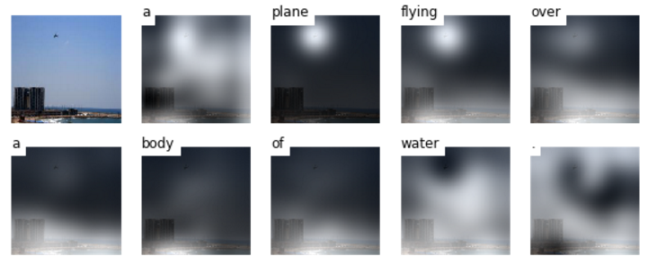

# Show, Attend and Tell 
TensorFlow implementation of [Show, Attend and Tell: Neural Image Caption Generation with Visual Attention] (http://arxiv.org/abs/1502.03044) which introduces an attention based image caption generator. The model changes its attention to the relevant part of the image while it generates each word.

<br/>


<br/>

## References
Referenced author's theano code can be found [here] (https://github.com/kelvinxu/arctic-captions). Additionally, this repo is an upgraded version of the existing tensorflow implementation. You can find it [here] (https://github.com/jazzsaxmafia/show_attend_and_tell.tensorflow).

<br/>


## Getting Started

#### Prerequisites 

This code is written in Python2.7 and requires [TensorFlow](https://www.tensorflow.org/versions/r0.11/get_started/os_setup.html#anaconda-installation). In addition, you need to install a few more packages to process [MSCOCO data set](http://mscoco.org/home/).
To install the required python packages, run:

```bash
$ pip install -r requirements
```

For evaluation, clone [pycocoevalcap](http://mscoco.org/dataset/#download) as below.

```bash
$ git clone https://github.com/tylin/coco-caption.git
```

#### Preparing the training data

A script is provided to download the MSCOCO image data and [VGGNet19](http://www.vlfeat.org/matconvnet/pretrained/). Downloading the data may take several hours depending on the network speed. Run commands below then the image data will be downloaded in the image directory and VGGNet will be downloaded in the data directory.

```bash
$ git clone https://github.com/yunjey/show-attend-and-tell-tensorflow.git
$ cd show-attend-and-tell
$ chmod +x ./download.sh
$ ./download.sh
```


For feeding the image to VGGNet, we should resize the MSCOCO image data to fixed size of 224x224. Run command below then train2014_resized and val2014_resized will be created in the image folder.

```bash
$ python resize.py
```

Before training the model, you have to preprocess the MSCOCO data set to generate `captions.pkl` and `features.hkl`. captions.pkl is a numpy array in which each row contains a list of word indices. Also, features.hkl is a numpy array which contains activation maps extracted from conv5_3 layer of VGGNet. 
To generate captions.pkl and features.pkl, run :

```bash
$ python prepro.py --batch_size=50 --max_length=15 --word_count_threshold=3
```

#### Train the model 

```bash
$ python train.py --batch_size=64 --epoch=15 --lr=0.001 --model_path='./model/lstm' --log_path='./log' 

```
#### (optional) Tensorboard visualization

For real time debugging, tensorboard visualization is provided. 
Open new terminal. Run command below and open `http://localhost:6005/` into your web browser.

```bash
$ tensorboard --logdir='./log' --port=6005 
```

#### Evaluate the model 

For evaluating the model, please see `evaluate_model.ipynb`.


<br/>

## Results
 
<br/>

####Training data

#####(1) Generated caption: A plane flying in the sky with a landing gear down.


#####(2) Generated caption: A giraffe and two zebra standing in the field.


####Validation data

#####(1) Generated caption: A large elephant standing in a dry grass field.


#####(2) Generated caption: A baby elephant standing on top of a dirt field.


####Test data

#####(1) Generated caption: A plane flying over a body of water.


#####(2) Generated caption: A zebra standing in the grass near a tree.


